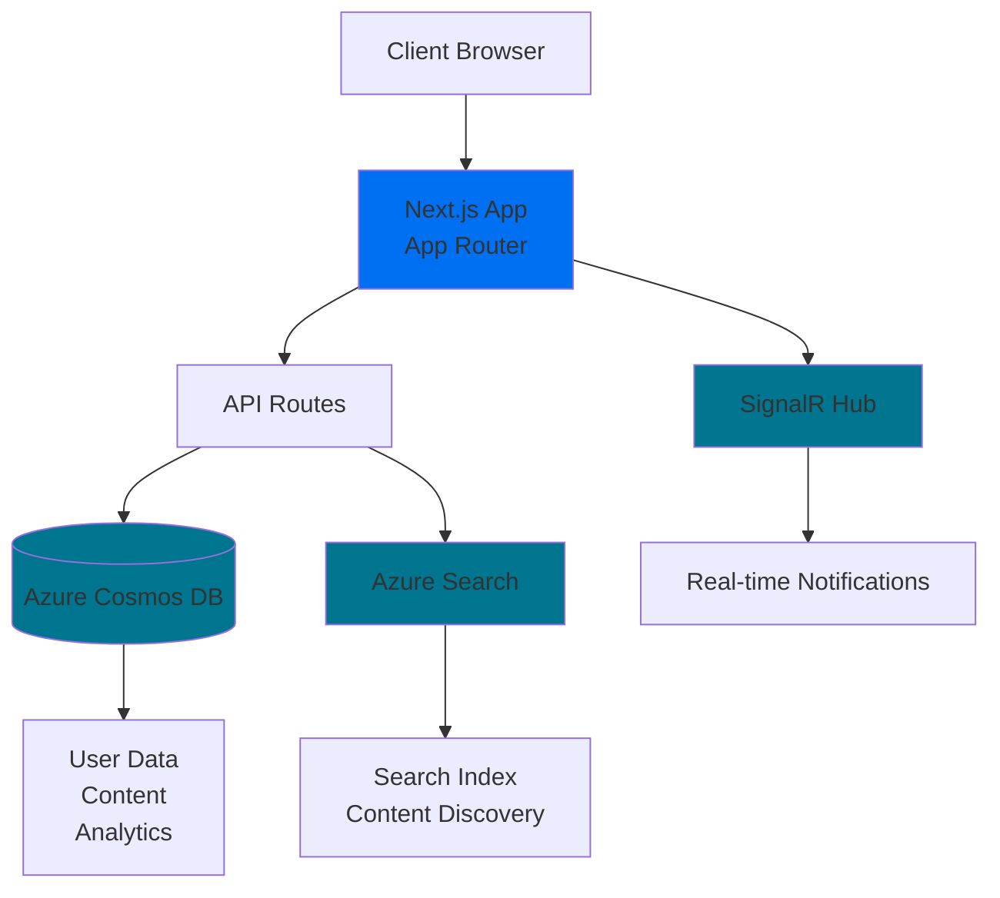

# System Architecture Overview

LearningHubz is a modern learning platform built with cutting-edge technologies to deliver a scalable, real-time, and globally distributed experience.

## Architecture Diagram

## Technology Stack

### Frontend
- **Next.js 14** - React framework with App Router
- **React 18** - UI library with Server Components
- **TypeScript** - Type-safe development
- **Tailwind CSS** - Utility-first styling
- **Radix UI** - Accessible component primitives
- **Framer Motion** - Animation library

### Backend
- **Next.js API Routes** - Serverless API endpoints
- **Azure Cosmos DB** - Global distributed database
- **Azure Search** - Full-text search and AI search
- **SignalR** - Real-time bidirectional communication

### Development & Deployment
- **TypeScript** - End-to-end type safety
- **ESLint & Prettier** - Code quality
- **Git** - Version control
- **GitHub** - Code hosting and CI/CD

## Key Features

### Hierarchical Partition Keys (HPK)
Cosmos DB is configured with hierarchical partition keys to:
- Overcome the 20 GB single partition limit
- Enable efficient multi-partition queries
- Support tenant isolation and data locality

### Real-time Communication
SignalR provides:
- Live notifications
- Real-time updates
- Collaborative features
- Event streaming

### Multi-language Support
Internationalization with next-intl:
- Multiple language support
- Dynamic locale switching
- Translation management

### Search Capabilities
Azure Search integration:
- Full-text search
- Faceted search
- Vector search for AI-powered discovery
- Search suggestions

## Data Flow

1. **User Request** → Client makes request to Next.js
2. **Server Processing** → Next.js App Router handles routing
3. **API Layer** → API routes process business logic
4. **Data Access** → Cosmos DB queries with optimized partition keys
5. **Search Integration** → Azure Search for content discovery
6. **Real-time Updates** → SignalR distributes live events
7. **Response** → Server-rendered or client-rendered response

## Security

- **Authentication** - NextAuth.js with multiple providers
- **Authorization** - Role-based access control (RBAC)
- **Data Encryption** - At rest and in transit
- **API Security** - Token-based authentication
- **CORS Configuration** - Controlled cross-origin requests

## Scalability

- **Horizontal Scaling** - Serverless architecture scales automatically
- **Global Distribution** - Cosmos DB multi-region replication
- **CDN** - Static assets cached globally
- **Edge Functions** - Compute at the edge for low latency

## Next Steps

- [Cosmos DB Data Modeling](/docs/architecture/data-modeling) - Learn about data design
- [API Design](/docs/architecture/api-design) - Understand API patterns
- [Deployment Architecture](/docs/deployment) - Infrastructure setup
